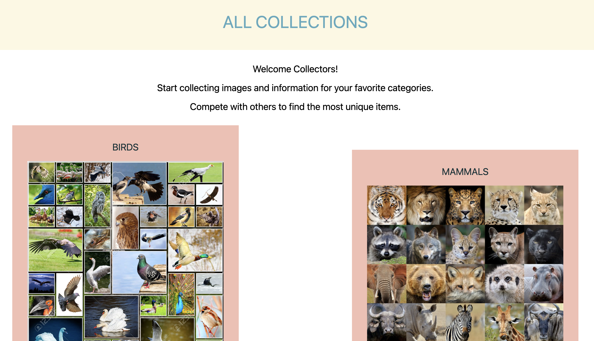
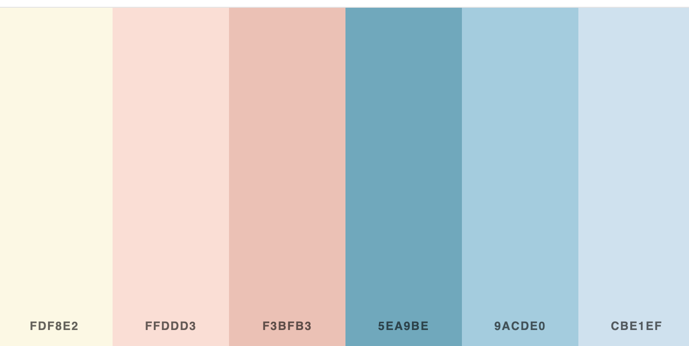

# The Collector App

[Live-Link - coming soon]()

- AAU => Signup, Login, and Logout to the collector app
- AAU => Select a collection to see all users entires
- AAU => Select a collection to add, edit, delete items to a specific collection only under that specific users collection
- AAU => If desired collection is not available, send a message to developer asking for a collection type to be added
- AAU => Sort specific collections by various keywords

## Technologies
- Python
- Django
- PostgreSQL
- Tailwind command = `python manage.py tailwind start`
- SendGrid

## Color Palette for design

### Citation for help taking messages as email
[Email with Django](https://learndjango.com/tutorials/django-email-contact-form-tutorial)
